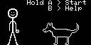
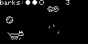
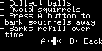

# Arduboy Go Fetch
Go Fetch is a simple game for the [Arduboy](https://www.arduboy.com/), an open-source, 8-bit game system.
The premise of the game is to collect balls while avoiding squirrels. You also have the ability to bark the squirrels away if you get into a bad situation.

  

  

  

# How to play
- On the start menu, hold 'A' until "Let go!" appears. Release 'A' to start the game.
- Once the game has started use the Up, Down, Left, & Right buttons to move the dog.
- Press 'A' to bark. This instantly removes squirrels in the bark zone
  - You only have 3 barks at a time, but they will refill with time
- At any point, press 'B' to enter a help menu with game instructions.
  - While in the help menu, press 'A' to toggle game volume.

# Requirements to Build
- [Arduboy2](https://github.com/MLXXXp/Arduboy2) library
- [ArduboyPlayTune](https://github.com/Ar-zz-duboy/ArduboyPlaytune) library
